## 1. Product Overview
Kitchenware ERP system designed to streamline operations for kitchenware businesses, managing the complete supply chain from supplier procurement to customer sales. This integrated platform handles inventory management, purchasing, sales processing, and provides real-time visibility across all business operations.

The system solves critical pain points in kitchenware retail including stock tracking across multiple product categories, supplier relationship management, order fulfillment, and customer service optimization. Target users include kitchenware retailers, restaurant suppliers, and culinary equipment distributors who need comprehensive business management tools.

## 2. Core Features

### 2.1 User Roles

| Role | Registration Method | Core Permissions |
|------|---------------------|------------------|
| Admin | Admin panel creation | Full system access, user management, system configuration |
| Manager | Admin assignment | Inventory management, purchasing approval, sales oversight, reporting |
| Sales Staff | Manager invitation | Customer management, order processing, sales tracking |
| Warehouse Staff | Manager invitation | Inventory updates, stock transfers, receiving shipments |
| Supplier | Admin invitation | Product catalog management, order fulfillment, invoice submission |

### 2.2 Feature Module

Our Kitchenware ERP system consists of the following main pages:

1. **Dashboard**: Real-time business overview, key metrics, alerts and notifications
2. **Inventory Management**: Stock levels, product catalog, warehouse locations, stock movements
3. **Sales Management**: Customer orders, quotations, invoicing, payment tracking
4. **Purchase Management**: Supplier orders, quotations, receiving, payment processing
5. **Customer Management**: Customer profiles, contact information, purchase history
6. **Supplier Management**: Supplier profiles, product catalogs, performance tracking
7. **Reports & Analytics**: Sales reports, inventory analysis, financial summaries
8. **Settings**: System configuration, user management, backup and security

### 2.3 Page Details

| Page Name | Module Name | Feature description |
|-----------|-------------|---------------------|
| Dashboard | Overview Cards | Display total sales, inventory value, pending orders, low stock alerts with real-time updates |
| Dashboard | Quick Actions | Provide shortcuts to create new order, add product, receive inventory, generate report |
| Dashboard | Recent Activity | Show latest orders, stock movements, customer interactions in chronological feed |
| Inventory Management | Product Catalog | Search, filter, and browse all kitchenware products with images, specifications, and pricing |
| Inventory Management | Stock Control | Update quantities across multiple warehouse locations, track minimum stock levels, set reorder points |
| Inventory Management | Stock Movements | Record and track all inventory transactions including receipts, transfers, adjustments, and sales |
| Sales Management | Order Processing | Create new orders, add products, calculate totals, apply discounts, generate invoices |
| Sales Management | Customer Orders | View order history, track order status, manage deliveries, process returns and refunds |
| Sales Management | Payment Tracking | Record payments, track outstanding balances, generate payment reminders, handle multiple payment methods |
| Purchase Management | Supplier Orders | Create purchase orders, send to suppliers, track order status, receive shipments |
| Purchase Management | Quotation Management | Request and compare supplier quotations, convert to purchase orders, track pricing history |
| Purchase Management | Receiving | Record received goods, update inventory, handle discrepancies, generate receiving reports |
| Customer Management | Customer Profiles | Store contact information, shipping addresses, payment terms, credit limits, and notes |
| Customer Management | Purchase History | Track all customer purchases, view order details, analyze buying patterns and preferences |
| Customer Management | Communication Log | Record customer interactions, set follow-up reminders, track support tickets |
| Supplier Management | Supplier Profiles | Maintain supplier information, contact details, product catalogs, terms and conditions |
| Supplier Management | Performance Tracking | Monitor delivery times, quality ratings, pricing competitiveness, and reliability metrics |
| Supplier Management | Product Catalog | Link supplier products to inventory, manage pricing agreements, track availability |
| Reports & Analytics | Sales Reports | Generate sales by period, product performance, customer analysis, and revenue trends |
| Reports & Analytics | Inventory Analysis | View stock turnover, aging analysis, dead stock identification, and reorder suggestions |
| Reports & Analytics | Financial Summary | Track profit margins, cash flow, accounts receivable/payable, and expense analysis |
| Settings | User Management | Add, edit, and deactivate users, assign roles and permissions, track user activity |
| Settings | System Configuration | Set company information, tax rates, currency, units of measure, and business rules |
| Settings | Backup & Security | Schedule automatic backups, configure access controls, view audit logs, manage data retention |

## 3. Core Process

### Standard Business Flow
1. **Purchase Process**: Manager creates purchase order → System sends to supplier → Supplier confirms → Warehouse receives goods → Inventory updates automatically → Payment processed

2. **Sales Process**: Sales staff creates customer order → System checks inventory availability → Order confirmed → Pick list generated → Invoice created → Payment recorded → Inventory deducted

3. **Inventory Management**: Warehouse staff monitors stock levels → System alerts for low stock → Automatic reorder suggestions → Purchase orders generated → Stock replenished

4. **Customer Service**: Customer inquiry → Sales staff accesses customer profile → View purchase history → Create quotation → Convert to order → Track fulfillment → Follow-up for satisfaction

### Page Navigation Flowchart

```mermaid
graph TD
  A[Dashboard] --> B[Inventory Management]
  A --> C[Sales Management]
  A --> D[Purchase Management]
  A --> E[Customer Management]
  A --> F[Supplier Management]
  A --> G[Reports & Analytics]
  A --> H[Settings]
  
  B --> B1[Product Catalog]
  B --> B2[Stock Control]
  B --> B3[Stock Movements]
  
  C --> C1[Order Processing]
  C --> C2[Customer Orders]
  C --> C3[Payment Tracking]
  
  D --> D1[Supplier Orders]
  D --> D2[Quotation Management]
  D --> D3[Receiving]
  
  E --> E1[Customer Profiles]
  E --> E2[Purchase History]
  E --> E3[Communication Log]
  
  F --> F1[Supplier Profiles]
  F --> F2[Performance Tracking]
  F --> F3[Product Catalog]
  
  G --> G1[Sales Reports]
  G --> G2[Inventory Analysis]
  G --> G3[Financial Summary]
  
  H --> H1[User Management]
  H --> H2[System Configuration]
  H --> H3[Backup & Security]
```

## 4. User Interface Design

### 4.1 Design Style
- **Primary Colors**: Professional blue (#2563EB) for primary actions, white background for clean interface
- **Secondary Colors**: Light gray (#F3F4F6) for backgrounds, green (#10B981) for success states, red (#EF4444) for alerts
- **Button Style**: Rounded corners (8px radius), clear hover states, consistent sizing across the platform
- **Font**: Inter font family, 14px for body text, 16px for headers, 12px for secondary information
- **Layout Style**: Card-based layout with clear sections, top navigation with sidebar menu, responsive grid system
- **Icons**: Material Design icons for consistency, custom kitchenware icons for product categories

### 4.2 Page Design Overview

| Page Name | Module Name | UI Elements |
|-----------|-------------|-------------|
| Dashboard | Overview Cards | Large numbered cards with icons, color-coded status indicators, real-time update animations |
| Dashboard | Quick Actions | Icon-based buttons in a grid layout, hover effects, keyboard shortcuts displayed |
| Dashboard | Recent Activity | Timeline-style feed with timestamps, color-coded activity types, expandable details |
| Inventory Management | Product Catalog | Search bar with filters, product cards with images, grid/list view toggle, bulk actions toolbar |
| Inventory Management | Stock Control | Table with editable cells, color-coded stock levels, inline editing, batch update capabilities |
| Sales Management | Order Processing | Multi-step form with progress indicator, product search with autocomplete, real-time calculations |
| Sales Management | Customer Orders | Data table with sorting and filtering, status badges, action buttons, export functionality |
| Purchase Management | Supplier Orders | Order form with supplier autocomplete, product selection, cost calculations, approval workflow |
| Reports & Analytics | Sales Reports | Interactive charts with date range picker, export options, drill-down capabilities, print-friendly views |

### 4.3 Responsiveness
Desktop-first design approach with full-featured interface optimized for 1920x1080 resolution. Mobile-adaptive design for tablets (768px and above) with touch-friendly interface elements. Touch interaction optimization includes larger tap targets, swipe gestures for navigation, and mobile-optimized forms. Critical features remain accessible on mobile devices while complex reporting and bulk operations are desktop-optimized.

### 4.4 Data Visualization
Charts and graphs use Chart.js library with consistent color scheme. Interactive elements include hover tooltips, clickable legends, and zoom/pan capabilities. Dashboard widgets auto-refresh every 30 seconds for real-time data. Export functionality provides PDF, Excel, and CSV formats for all reports.