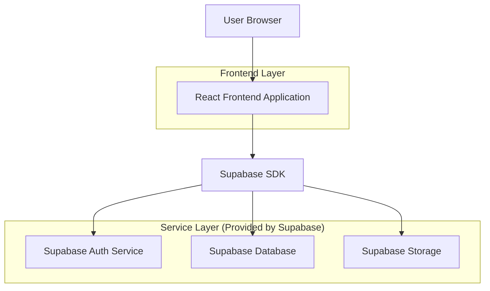
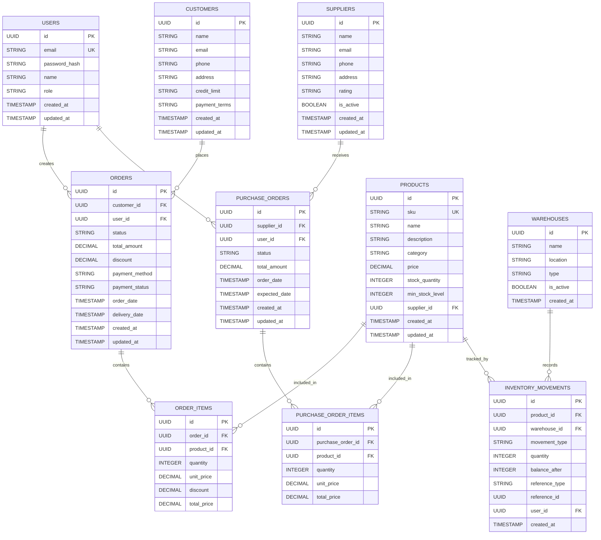

## 1. Architecture design



## 2. Technology Description

* **Frontend**: React\@18 + tailwindcss\@3 + vite

* **Initialization Tool**: vite-init

* **Backend**: Supabase (BaaS)

* **Database**: Supabase PostgreSQL

* **Authentication**: Supabase Auth

* **File Storage**: Supabase Storage

* **Real-time**: Supabase Realtime for live updates

## 3. Route definitions

| Route                   | Purpose                                                      |
| ----------------------- | ------------------------------------------------------------ |
| /                       | Dashboard - Main overview with key metrics and quick actions |
| /login                  | Login page - User authentication with email/password         |
| /inventory              | Inventory management - Product catalog and stock control     |
| /inventory/products     | Product list - Browse and manage all products                |
| /inventory/stock        | Stock control - Update quantities and locations              |
| /inventory/movements    | Stock movements - Track all inventory transactions           |
| /sales                  | Sales management - Order processing and customer management  |
| /sales/orders           | Order list - View and manage all customer orders             |
| /sales/orders/new       | New order - Create customer order with product selection     |
| /sales/customers        | Customer list - Manage customer profiles and history         |
| /purchasing             | Purchase management - Supplier orders and receiving          |
| /purchasing/orders      | Purchase orders - Create and track supplier orders           |
| /purchasing/quotations  | Quotations - Request and compare supplier quotes             |
| /purchasing/receiving   | Receiving - Record received goods and update inventory       |
| /suppliers              | Supplier management - Maintain supplier relationships        |
| /reports                | Reports - Generate sales, inventory, and financial reports   |
| /settings               | Settings - System configuration and user management          |
| /settings/users         | User management - Add and manage system users                |
| /settings/configuration | Configuration - Set business rules and preferences           |

## 4. API definitions

### 4.1 Authentication APIs

```
POST /auth/v1/token
```

Request:

| Param Name | Param Type | isRequired | Description        |
| ---------- | ---------- | ---------- | ------------------ |
| email      | string     | true       | User email address |
| password   | string     | true       | User password      |

Response:

| Param Name     | Param Type | Description                 |
| -------------- | ---------- | --------------------------- |
| access\_token  | string     | JWT token for API access    |
| refresh\_token | string     | Token for refreshing access |
| user           | object     | User profile information    |

### 4.2 Product Management APIs

```
GET /rest/v1/products
```

Request Query Parameters:

| Param Name | Param Type | isRequired | Description                |
| ---------- | ---------- | ---------- | -------------------------- |
| select     | string     | false      | Columns to select          |
| category   | string     | false      | Filter by category         |
| search     | string     | false      | Search in name/description |
| limit      | number     | false      | Number of results          |
| offset     | number     | false      | Pagination offset          |

Response:

| Param Name        | Param Type | Description               |
| ----------------- | ---------- | ------------------------- |
| id                | UUID       | Product unique identifier |
| sku               | string     | Stock keeping unit        |
| name              | string     | Product name              |
| description       | string     | Product description       |
| category          | string     | Product category          |
| price             | number     | Unit price                |
| stock\_quantity   | number     | Available stock           |
| min\_stock\_level | number     | Reorder point             |

### 4.3 Order Management APIs

```
POST /rest/v1/orders
```

Request:

| Param Name      | Param Type | isRequired | Description          |
| --------------- | ---------- | ---------- | -------------------- |
| customer\_id    | UUID       | true       | Customer identifier  |
| order\_items    | array      | true       | Array of order items |
| total\_amount   | number     | true       | Order total          |
| payment\_method | string     | true       | Payment method       |

Order Item Object:

```json
{
  "product_id": "uuid",
  "quantity": 5,
  "unit_price": 29.99,
  "discount": 0
}
```

## 5. Data model

### 6.1 Data model definition



### 6.2 Data Definition Language

Users Table

```sql
-- create table
CREATE TABLE users (
    id UUID PRIMARY KEY DEFAULT gen_random_uuid(),
    email VARCHAR(255) UNIQUE NOT NULL,
    password_hash VARCHAR(255) NOT NULL,
    name VARCHAR(100) NOT NULL,
    role VARCHAR(20) NOT NULL CHECK (role IN ('admin', 'manager', 'sales', 'warehouse')),
    is_active BOOLEAN DEFAULT true,
    created_at TIMESTAMP WITH TIME ZONE DEFAULT NOW(),
    updated_at TIMESTAMP WITH TIME ZONE DEFAULT NOW()
);

-- create index
CREATE INDEX idx_users_email ON users(email);
CREATE INDEX idx_users_role ON users(role);

-- grant permissions
GRANT SELECT ON users TO anon;
GRANT ALL PRIVILEGES ON users TO authenticated;
```

Products Table

```sql
-- create table
CREATE TABLE products (
    id UUID PRIMARY KEY DEFAULT gen_random_uuid(),
    sku VARCHAR(50) UNIQUE NOT NULL,
    name VARCHAR(255) NOT NULL,
    description TEXT,
    category VARCHAR(100),
    price DECIMAL(10,2) NOT NULL,
    stock_quantity INTEGER DEFAULT 0,
    min_stock_level INTEGER DEFAULT 0,
    supplier_id UUID REFERENCES suppliers(id),
    is_active BOOLEAN DEFAULT true,
    created_at TIMESTAMP WITH TIME ZONE DEFAULT NOW(),
    updated_at TIMESTAMP WITH TIME ZONE DEFAULT NOW()
);

-- create index
CREATE INDEX idx_products_sku ON products(sku);
CREATE INDEX idx_products_category ON products(category);
CREATE INDEX idx_products_supplier ON products(supplier_id);

-- grant permissions
GRANT SELECT ON products TO anon;
GRANT ALL PRIVILEGES ON products TO authenticated;
```

Orders Table

```sql
-- create table
CREATE TABLE orders (
    id UUID PRIMARY KEY DEFAULT gen_random_uuid(),
    customer_id UUID REFERENCES customers(id) NOT NULL,
    user_id UUID REFERENCES users(id) NOT NULL,
    status VARCHAR(20) DEFAULT 'pending' CHECK (status IN ('pending', 'confirmed', 'shipped', 'delivered', 'cancelled')),
    total_amount DECIMAL(10,2) NOT NULL,
    discount DECIMAL(10,2) DEFAULT 0,
    payment_method VARCHAR(50),
    payment_status VARCHAR(20) DEFAULT 'pending' CHECK (payment_status IN ('pending', 'paid', 'partial', 'refunded')),
    order_date TIMESTAMP WITH TIME ZONE DEFAULT NOW(),
    delivery_date TIMESTAMP WITH TIME ZONE,
    created_at TIMESTAMP WITH TIME ZONE DEFAULT NOW(),
    updated_at TIMESTAMP WITH TIME ZONE DEFAULT NOW()
);

-- create index
CREATE INDEX idx_orders_customer ON orders(customer_id);
CREATE INDEX idx_orders_user ON orders(user_id);
CREATE INDEX idx_orders_status ON orders(status);
CREATE INDEX idx_orders_date ON orders(order_date);

-- grant permissions
GRANT SELECT ON orders TO anon;
GRANT ALL PRIVILEGES ON orders TO authenticated;
```

Inventory Movements Table

```sql
-- create table
CREATE TABLE inventory_movements (
    id UUID PRIMARY KEY DEFAULT gen_random_uuid(),
    product_id UUID REFERENCES products(id) NOT NULL,
    warehouse_id UUID REFERENCES warehouses(id) NOT NULL,
    movement_type VARCHAR(20) NOT NULL CHECK (movement_type IN ('in', 'out', 'transfer', 'adjustment')),
    quantity INTEGER NOT NULL,
    balance_after INTEGER NOT NULL,
    reference_type VARCHAR(50),
    reference_id UUID,
    user_id UUID REFERENCES users(id) NOT NULL,
    notes TEXT,
    created_at TIMESTAMP WITH TIME ZONE DEFAULT NOW()
);

-- create index
CREATE INDEX idx_inventory_movements_product ON inventory_movements(product_id);
CREATE INDEX idx_inventory_movements_warehouse ON inventory_movements(warehouse_id);
CREATE INDEX idx_inventory_movements_type ON inventory_movements(movement_type);
CREATE INDEX idx_inventory_movements_date ON inventory_movements(created_at);

-- grant permissions
GRANT SELECT ON inventory_movements TO anon;
GRANT ALL PRIVILEGES ON inventory_movements TO authenticated;
```

Row Level Security (RLS) Policies

```sql
-- Enable RLS on all tables
ALTER TABLE users ENABLE ROW LEVEL SECURITY;
ALTER TABLE products ENABLE ROW LEVEL SECURITY;
ALTER TABLE orders ENABLE ROW LEVEL SECURITY;
ALTER TABLE inventory_movements ENABLE ROW LEVEL SECURITY;

-- Users can only view active users
CREATE POLICY "Users can view active users" ON users
    FOR SELECT USING (is_active = true);

-- Users can only view products that are active
CREATE POLICY "Users can view active products" ON products
    FOR SELECT USING (is_active = true);

-- Users can only view orders they created or all orders if they are manager/admin
CREATE POLICY "Users can view their own orders" ON orders
    FOR SELECT USING (
        auth.uid() = user_id OR 
        EXISTS (
            SELECT 1 FROM users 
            WHERE id = auth.uid() 
            AND role IN ('admin', 'manager')
        )
    );

-- Users can only insert inventory movements for products they have access to
CREATE POLICY "Users can manage inventory" ON inventory_movements
    FOR ALL USING (
        EXISTS (
            SELECT 1 FROM users 
            WHERE id = auth.uid() 
            AND role IN ('admin', 'manager', 'warehouse')
        )
    );
```

